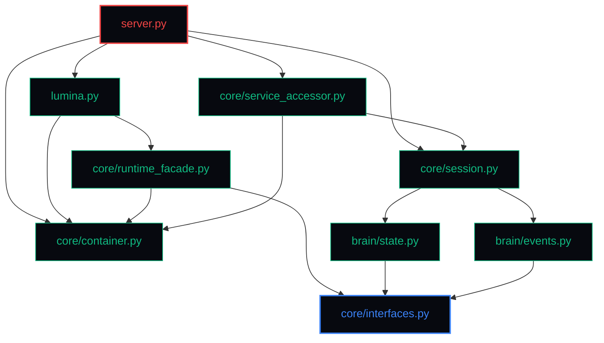

# Lumina V2 Dependency Graph Specification

This document maps the structural import hierarchies and dependency regulations of Lumina V2. It specifies how modules are allowed to interact and highlights areas of architectural boundaries.

---

## 1. Import Hierarchy & Coupling Rules

To prevent circular dependency risks and isolate components, Lumina V2 enforces a strict unidirectional dependency hierarchy. Lower layers must never import or possess direct knowledge of higher layers.



---

## 2. Dynamic Override Access Pathways (DI Overrides)

During runtime, concrete class instances created by the legacy `AudioLoop` constructor are injected into the DI container as interface overrides. This allows the application entry points and tools to retrieve services via abstract interface queries.

```mermaid
sequenceDiagram
    autonumber
    participant Server as server.py
    participant Loop as AudioLoop (lumina.py)
    participant Container as DI Container (container.py)
    participant Accessor as ServiceAccessor (service_accessor.py)

    Server->>Loop: Instantiate AudioLoop()
    Loop->>Loop: Creates concrete MemoryStore & ProjectManager
    Server->>Container: Override(IMemoryManager, AudioLoop.memory_store)
    Server->>Container: Override(IWorkspaceManager, AudioLoop.project_manager)
    
    Note over Accessor, Container: Callers query ServiceAccessor for properties
    Accessor->>Container: resolve(IMemoryManager)
    alt Registration Available
        Container-->>Accessor: Return active MemoryStore instance
    else Startup Fallback
        Accessor-->>Loop: Retrieve loop.memory_store directly
    end
```

---

## 3. Dependency coupling metrics

The table below catalogs import scopes and coupling constraints across core modules:

| Source Module | Target Module | Coupling Type | Allowable Actions / Constraints |
|---|---|---|---|
| `server.py` | `lumina.py` | Import & Control | Controls connection loops and initiates runtime sessions. |
| `lumina.py` | `core/runtime_facade.py` | Facade queries | Requests state snapshot verification and records tool updates. |
| `core/services.py` | `core/container.py` | Resolution queries | Resolves contracts from the globally shared DI container instance. |
| `core/interfaces.py` | Any | None | Strict Interface definitions. Must not import any concrete classes. |
| `brain/state.py` | `core/interfaces.py` | Interface Compliance | Satisfies state contracts. Cannot import `lumina.py` or `server.py`. |

---

## 4. Circular Dependency Hotspots & Constraints

> [!WARNING]
> **CIRCULAR DEPS PROTECTION**: Under no circumstances should any module in `core/` or `brain/` import `server.py` or `lumina.py`. All upward notifications must go through the `EventBus` using decoupled topic strings.
> **VIRTUAL CONTRACTS**: Since legacy components (`MemoryStore`, `ProjectManager`, `MemoryEngine`) do not inherit directly from abstract interfaces, they are virtually bound using the ABC register pattern `IWorkspaceManager.register(ProjectManager)` during bootstrap execution.
