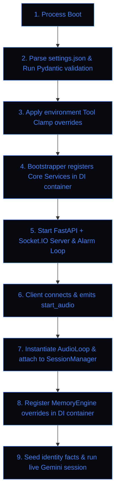
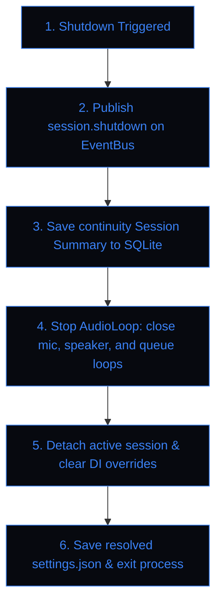
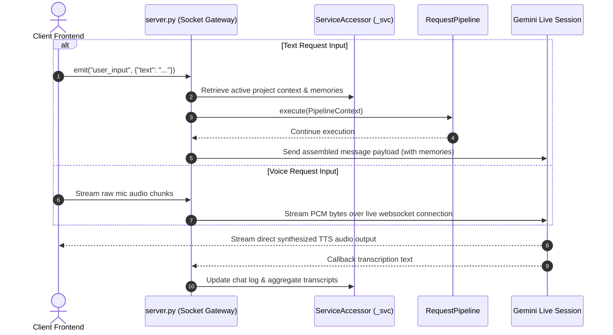
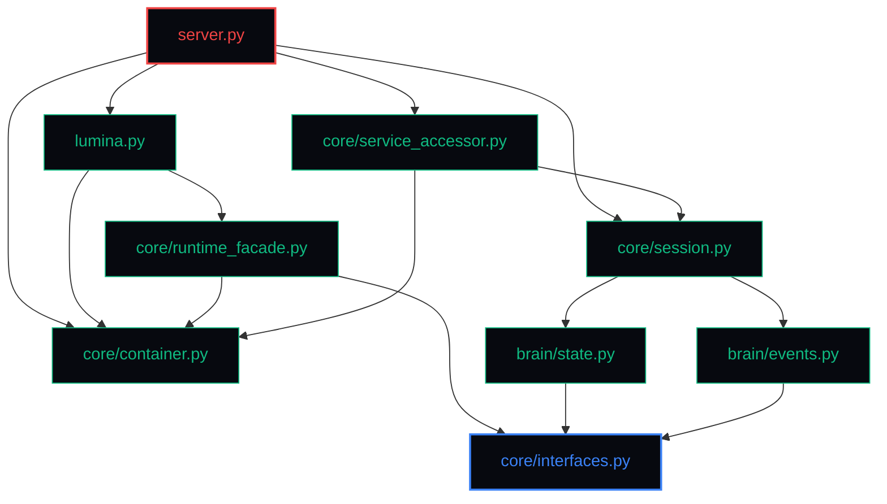

# Lumina V2 System Flows & Dependencies

This document specifies the interaction flows, execution sequences, and dependency regulations of Lumina V2.

---

## 1. Interaction Sequences

### Startup Sequence Flow



### Shutdown Sequence Flow



### User Request Turn Cycles



### Tool Confirmation Gate Sequence

```mermaid
sequenceDiagram
    autonumber
    participant Gemini as Gemini Live Session
    participant Loop as AudioLoop (lumina.py)
    participant Registry as ToolDispatcherRegistry
    participant Client as Frontend Client

    Gemini->>Loop: Returns Tool FunctionCall (e.g. click dangerous text)
    Loop->>Loop: Evaluate settings.json tool permissions
    alt Requires User Confirmation
        Loop->>Client: emit("tool_confirmation_request", {id, tool, args})
        Note over Client: Visual Popup Overlay shown to user
        Client-->>Loop: User clicks Approve (True) / Deny (False)
    else Relaxed Mode
        Note over Loop: Auto-confirms action
    end

    alt Confirmed
        Loop->>Registry: dispatch(FunctionCall)
        Registry-->>Loop: Return tool execution results
        Loop->>Gemini: Send FunctionResponse
    else Rejected
        Loop->>Gemini: Send cancellation/rejection response
    end
```

---

## 2. Dependency Graph & Import Regulations

To preserve modular boundaries and eliminate circular import risks, Lumina enforces a strict import hierarchy.

### Layer Hierarchy



### Architectural Import Rules

1. **Decoupled Upward Notifications**: No module under `core/` or `brain/` is permitted to import `server.py` or `lumina.py`. All communication to higher layers must occur via EventBus topic publication.
2. **Virtual Registrations**: Since legacy data models (`MemoryStore`, `ProjectManager`) do not directly inherit from abstract classes, they are registered dynamically in `bootstrap.py` using standard ABC helper bindings (e.g. `IWorkspaceManager.register(ProjectManager)`).
3. **No Direct Thread Mutations**: Callers must never cache service objects returned by `ServiceAccessor` properties (like `_svc.memory_store`). They should query properties dynamically to avoid reference corruption across threads.
