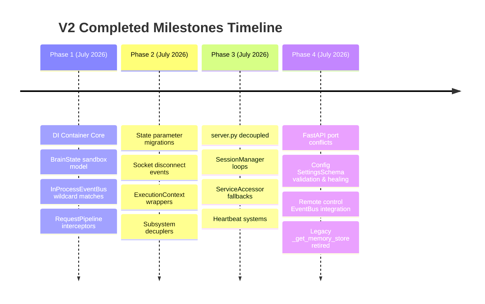

# Lumina V2 Phase History Specification

This document details the completed development phases, major changes, and validation suites of Lumina V2.

---

## 1. Timeline Overview

---

## 2. Completed Phase Details

### Phase 1 — Foundations (Phases 1.1 to 1.8)
- **Goal**: Establish the base dependency injection registry, transaction-managed state model, wildcard event bus, and request execution stack.
- **Major Changes**:
  - Created `DependencyContainer` for thread-safe bindings.
  - Implemented `BrainState` with Pydantic schemas, frozen `BrainSnapshot` copies, and rollback transactions.
  - Implemented `InProcessEventBus` for local pub/sub.
  - Created `RequestPipeline` interceptor and context models.
  - Defined abstract interfaces in `interfaces.py`.
- **Files Modified**:
  - `backend/core/container.py` [NEW]
  - `backend/core/interfaces.py` [NEW]
  - `backend/core/bootstrap.py` [NEW]
  - `backend/core/runtime_facade.py` [NEW]
  - `backend/brain/state.py` [NEW]
  - `backend/brain/events.py` [NEW]
  - `backend/core/pipeline.py` [NEW]
  - `backend/core/context.py` [NEW]
  - `backend/core/validation.py` [NEW]
- **Verification**: `test_phase_1_2.py` (21/21 PASS)

### Phase 2 — Brain Runtime & State Migrations (Phases 2.1 to 2.8)
- **Goal**: Transition execution boundaries from concrete global references to DI-resolved interfaces.
- **Major Changes**:
  - Migrated `pending_confirmation_id` to `BrainState` database managed by `RuntimeFacade`.
  - Converted socket client disconnect handlers to publish `session.disconnected` events on `EventBus`.
  - Wrapped `create_quest` calls in hierarchical `ExecutionContext` tokens and ran them through `RequestPipeline`.
  - Decoupled `get_memories`, `generate_cad`, `list_projects` and `AudioLoop` chat log writes to query DI interface handlers (`IMemoryManager` and `IWorkspaceManager`).
- **Files Modified**:
  - `backend/server.py`
  - `backend/lumina.py`
  - `backend/core/tool_handlers.py`
- **Verification**: `test_phase_2_1.py` through `test_phase_2_8.py` (26/26 PASS)

### Phase 3 — Complete Architectural Migration
- **Goal**: Decouple `server.py` from active `AudioLoop` fields and centralize service lifecycle lookups.
- **Major Changes**:
  - Created `SessionManager` to govern session attach/detach states and update connection timers.
  - Created `ServiceAccessor` bridge to lookup from container with passive fallback hooks.
  - Refactored `server.py` endpoints (quests, events, archive REST APIs) to resolve via `ServiceAccessor`.
- **Files Modified**:
  - `backend/core/session.py` [NEW]
  - `backend/core/service_accessor.py` [NEW]
  - `backend/server.py`
- **Verification**: `test_phase_3.py` (4/4 PASS)

### Phase 4 — Stable Runtime Recovery
- **Goal**: Stabilize server runtime, handle port conflicts, validate/heal config schemas, and eliminate legacy bypass paths.
- **Major Changes**:
  - Implemented `find_available_port()` in uvicorn main startup to scanner ports 8000–8009 automatically.
  - Added FastAPI shutdown handlers to publish `session.shutdown` event.
  - Resolved concrete `IMemoryManager` and `IWorkspaceManager` dependencies in `AudioLoop` constructor from DI.
  - Implemented `SettingsSchema` (Pydantic Settings model) and `validate_and_repair_settings()` self-healing logic.
  - Routed mobile paired dashboard endpoints (connection status, phone mic streams, and commands) to publish over EventBus.
  - **Milestone 4.6**: Eliminated legacy bypass `_get_memory_store()` function in `server.py`. Replaced all 15 call-sites with `_svc.memory_store`. Created `/debug/events` route. Created ARCHITECTURE.md.
- **Files Modified**:
  - `backend/server.py`
  - `backend/lumina.py`
  - `backend/core/bootstrap.py`
  - `backend/core/config_schema.py` [NEW]
  - `backend/dashboard_routes.py`
- **Verification**:
  - `test_phase_4_1.py` (2/2 PASS)
  - `test_phase_4_5.py` (3/3 PASS)
  - `test_phase_4_6.py` (7/7 PASS)

### Phase 5 — Cognitive Architecture (FROZEN)
- **Goal**: Add a decoupled "Brain" cognitive layer around the frozen runtime —
  orchestration, planning, skills, workspace memory, reflection, and read-only
  workspace reasoning — without changing runtime behavior.
- **Milestones**:
  - **5.1** `BrainCore` orchestrator + frozen value objects (`BrainRequest`,
    `BrainContext`, `Plan`, `Task`, `BrainResult`, `Reflection`).
  - **5.2–5.3** `RulePlanner`, `LLMPlanner` (inert until a gateway binds),
    `PlannerChain`, `SkillManager`/`SkillRegistry`.
  - **5.5** Capability Layer — skill metadata, capability discovery,
    metadata-driven planning (`CapabilityResolver`).
  - **5.6** Workspace Memory — `WorkspaceMemory`, `WorkspaceMemoryStore`,
    `WorkspaceMemoryManager`, `WorkspaceSync`; `ContextBuilder` reads snapshot.
  - **5.7** Reflection Engine — deterministic, read-only; attached by BrainCore.
  - **5.8** Workspace Activation — `RuntimeFacade.activate_workspace`, idempotent,
    flag-gated (default off → byte-identical runtime).
  - **5.9** Workspace Reasoning — `WorkspaceRetriever`;
    Decision/Notes/Task/Architecture recall; workspace-aware planning
    (`WorkspaceRecallContext`); workspace-aware prompting
    (`PromptWorkspaceContext`); project context injection (`prompt_builder.py`).
    Boundary defined in ADR-0007.
- **Files**: `backend/brain/core/*`, `backend/brain/planning/*`,
  `backend/brain/skills/*`, `backend/brain/workspace/*`,
  `backend/brain/reflection/*`, `backend/core/runtime_facade.py`,
  `backend/core/bootstrap.py`.
- **Verification**: `test_phase_5*.py` (404 PASS). Status: COMPLETE · FROZEN.

### Phase 6 — Evolution Engine (VALIDATED · FROZEN)
- **Goal**: Add an analysis-only Evolution Engine that observes the runtime and
  produces immutable recommendations — never mutating runtime (ADR-0008). Every
  component is dormant (registered in DI, consumed by no runtime path).
- **Milestones**:
  - **6.1** Reflection Learning — `EvolutionObserver`, `EvolutionObservation`,
    append-only `EvolutionStore`.
  - **6.2** Strategy Improvement — `StrategyEvaluator` → `StrategyAnalysis`.
  - **6.3** Performance Analysis — `PerformanceAnalyzer` → `PerformanceAnalysis`.
  - **6.4** Memory Consolidation — `MemoryConsolidator` →
    `ConsolidationProposalSet` (read-only proposals; never writes memory).
  - **6.5** Self Evolution — `RecommendationEngine` (PerformanceAnalysis +
    ConsolidationProposalSet) → `EvolutionRecommendationSet`.
  - **6.6** Validation & Freeze.
- **Files**: `backend/brain/evolution/*`, `backend/core/bootstrap.py`.
- **Verification**: `test_phase_6_step1..5.py` (76 PASS); full Phase 5+6
  regression 480 PASS. Status: COMPLETE · VALIDATED · FROZEN.

See `Docs/04_Guides/FEATURE_GUIDE.md` for how each subsystem works.
