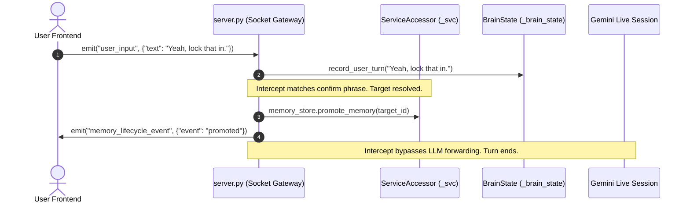

# Lumina V2 Event Flow Specification

This document defines the pub/sub event lifecycle, socket interfaces, and background notification mechanisms of Lumina V2.

---

## 1. System Event Architecture

Lumina V2 utilizes a dual-tier event distribution model:
1. **Frontend-to-Backend Socket Gateway**: Coordinates low-latency real-time streams (audio, video, UI state updates) over Socket.IO.
2. **In-Process EventBus**: Coordinates decoupled background state notifications (attaches, detaches, shutdown cycles) asynchronously.

```
                  ┌─────────────────────────────────────┐
                  │          Frontend Client            │
                  └──────────┬──────────────────▲───────┘
                             │ (Socket.IO)      │ (Socket.IO)
                             ▼                  │
             ┌─────────────────────────┐  ┌─────┴───────────────────┐
             │   Incoming Gateway      │  │    Outgoing Emits       │
             │   (user_input, etc.)    │  │   (transcription,     │
             │                         │  │    memory_lifecycle)    │
             └───────────┬─────────────┘  └─────▲───────────────────┘
                         │                      │
                         ▼                      │
     ┌──────────────────────────────────────────────────────────┐
     │                      LUMINA CORE                         │
     │   ┌──────────────────┐            ┌──────────────────┐   │
     │   │   SessionManager │            │     EventBus     │   │
     │   └────────┬─────────┘            └────────▲─────────┘   │
     │            │                               │             │
     │            └─────── (publishes topic) ─────┘             │
     └──────────────────────────────────────────────────────────┘
```

---

## 2. Event Routing Specification

### A. In-Process EventBus Topics

| Topic | Publisher | Subscribers | Payload Schema | Description |
|---|---|---|---|---|
| `session.audio_attached` | `SessionManager` | Debug loggers, turn metrics | `{"attached_at": float}` | Published when `AudioLoop` is active and attached. |
| `session.audio_detached` | `SessionManager` | Summary generators, stats | `{"detached_at": float}` | Published when `AudioLoop` terminates or stops. |
| `session.shutdown` | `server.py` (shutdown) | Subsystem flushers | `{"reason": str}` | Published on FastAPI process shutdown. |

### B. Socket.IO Gateway Interface

| Event Channel | Direction | Payload Example | Description |
|---|---|---|---|
| `user_input` | Frontend → Backend | `{"text": "hello"}` | Real-time text request from the client input. |
| `transcription` | Backend → Frontend | `{"text": "...", "sender": "Lumina"}` | Dispatches real-time STT / TTS text for chat bubble render. |
| `memory_lifecycle_event`| Backend → Frontend | `{"event": "pending", "id": "m1"}` | Broadcasts updates on memory confirmations/promotions. |
| `cad_data` | Backend → Frontend | `{"file_path": "...", "data": "stl..."}`| Sends newly compiled STL file payloads for preview. |

---

## 3. Real-Time Interaction Sequence

The diagram below details the sequence of events triggered when the user issues a request that matches a pending memory confirmation:



---

## 4. Diagnostics & Auditing

> [!NOTE]
> **DELIVERY ASSURANCE**: The `InProcessEventBus` utilizes thread-safe lists for handler storage. Handlers execute concurrently inside asyncio tasks. Any exceptions thrown by handlers are caught and logged to prevent system crash cascades.
