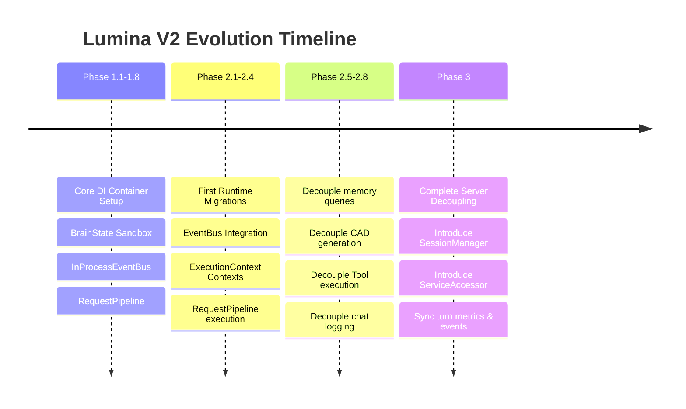

# Lumina V2 Phase History Specification

This document records the design progression, implementations, and verification steps of Lumina V2 architectural refactoring.

---

## 1. Timeline Summary

The migration focuses on moving from legacy globals and direct coupling to a clean, interface-first, dependency-injected architecture.

---

## 2. Detailed Phase Implementations

### Phase 1 — Foundations (Phases 1.1 to 1.8)
* **Goal**: Establish the base DI container, sandbox data structure, event messaging, and middleware execution stack.
* **Key Achievements**:
  * Added abstract interface definitions (`interfaces.py`).
  * Created thread-safe `DependencyContainer` with override bindings.
  * Implemented transaction-managed, Pydantic-validated `BrainState` database.
  * Wired `InProcessEventBus` and sealed `RequestPipeline`.
  * Introduced pass-through adapters and service registry introspection.

### Phase 2 — Incremental Runtime Migrations (Phases 2.1 to 2.8)
* **Goal**: Move target execution contexts from concrete class bindings to DI interfaces.
* **Key Achievements**:
  * **Phase 2.1**: Moved `pending_confirmation_id` storage to `BrainState` managed by `RuntimeFacade`.
  * **Phase 2.2**: Migrated client socket disconnect triggers to publish on `EventBus`.
  * **Phase 2.3**: Wrapped `create_quest` parameters in structured `ExecutionContext` instances.
  * **Phase 2.4**: Executed quest creations through `RequestPipeline` middlewares.
  * **Phase 2.5**: Decoupled `get_memories` queries to resolve through `IMemoryManager`.
  * **Phase 2.6**: Decoupled `generate_cad` paths to resolve through `IWorkspaceManager`.
  * **Phase 2.7**: Decoupled tool handlers to resolve through `IWorkspaceManager`.
  * **Phase 2.8**: Decoupled chat log flushes in `AudioLoop` to resolve through `IWorkspaceManager`.

### Phase 3 — Complete Architectural Migration
* **Goal**: Decouple `server.py` from active `AudioLoop` concrete attributes and unify service routing.
* **Key Achievements**:
  * Implemented `SessionManager` to capture and govern `AudioLoop` lifecycle states.
  * Implemented `ServiceAccessor` to route requests first to container overrides with fallback mechanisms.
  * Refactored `server.py` event gateways, REST APIs, and command intercepts to use accessor routing.
  * Synchronized turn events with `BrainState.record_user_turn`.
  * Published shutdown events on the `EventBus` during process termination.

---

## 3. Verification Metrics History

All migrations were validated using regression testing suites:

| Phase | Test File | Test Count | Result | Verification Scope |
|---|---|---|---|---|
| **Phase 1.2** | `test_phase_1_2.py` | 21 / 21 | **PASS** ✅ | BrainState sandbox operations, transaction integrity, and EventBus deliveries. |
| **Phase 2.1** | `test_phase_2_1.py` | 5 / 5 | **PASS** ✅ | Core container registrations and tool confirmation state handling. |
| **Phase 2.2** | `test_phase_2_2.py` | 4 / 4 | **PASS** ✅ | EventBus subscription triggers during socket disconnects. |
| **Phase 2.3** | `test_phase_2_3.py` | 4 / 4 | **PASS** ✅ | Context validation and transaction metrics mapping. |
| **Phase 2.4** | `test_phase_2_4.py` | 4 / 4 | **PASS** ✅ | RequestPipeline quest creation and execution loops. |
| **Phase 2.5** | `test_phase_2_5.py` | 3 / 3 | **PASS** ✅ | IMemoryManager resolution over socket query interfaces. |
| **Phase 2.6** | `test_phase_2_6.py` | 3 / 3 | **PASS** ✅ | WorkspaceManager project path queries inside generate_cad. |
| **Phase 2.7** | `test_phase_2_7.py` | 3 / 3 | **PASS** ✅ | WorkspaceManager resolution in ToolDispatcherRegistry. |
| **Phase 2.8** | `test_phase_2_8.py` | 2 / 2 | **PASS** ✅ | AudioLoop chat flushing decoupled logging queries. |
| **Phase 3** | `test_phase_3.py` | 4 / 4 | **PASS** ✅ | SessionManager attach/detach loops, ServiceAccessor fallbacks. |
