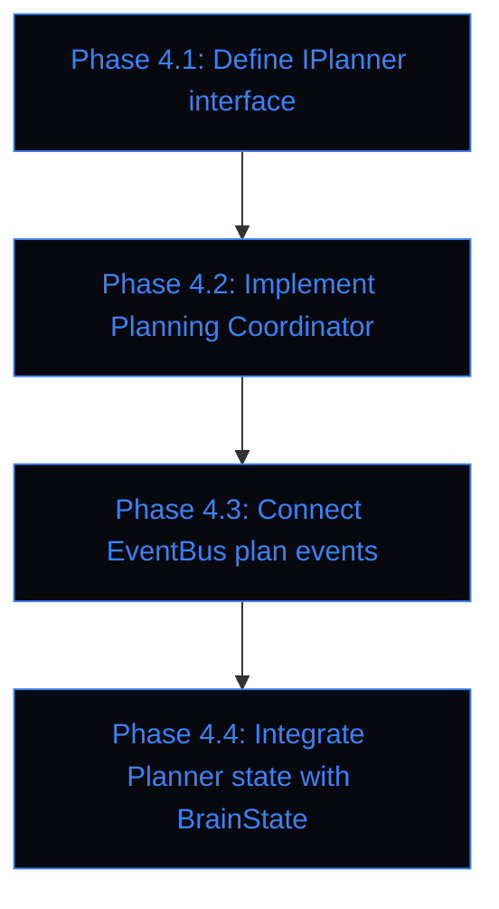

# Lumina V2 Evolution Roadmap & Audit Specification

This document details the architectural audit findings, recommends a classification list for upcoming refactoring runs, and details the Phase 4 design roadmap.

---

## 1. Architectural Audit Findings

Our review of the Lumina V2 codebase identified the following issues classified by severity:

### Critical
* **None detected**. The core execution context, DI container, and state isolation are intact. There are no crashes or database corruption risks.

### High
1. **DI & Instantiation Inversion in `AudioLoop`**: `AudioLoop` directly instantiates concrete components (`MemoryStore`, `ProjectManager`, `CadAgent`, `PrinterAgent`, `KasaAgent`) in its constructor instead of resolving them from the DI container or accepting them as injected dependencies. The container overrides are registered *post-hoc* in `server.py` startup, causing a "chicken-and-egg" chicken-egg lifecycle coupling.
2. **Global Module-Level State in `server.py`**: Multiple module-level globals in `server.py` (`audio_loop`, `loop_task`, `authenticator`, `last_user_activity`, `idle_disabled_until_ts`) are mutated across asynchronous events without proper thread/task locking, risking trace corruption or race conditions during rapid voice reconnects.
3. **Bypass of `ServiceAccessor` in Socket/REST CRUD Endpoints**: In `server.py`, multiple event handlers (e.g. `list_quests`, `create_quest`, etc.) bypass the `_svc` (ServiceAccessor) or `container` entirely and call `_get_memory_store()` which returns a concrete `MemoryStore` reference.

### Medium
1. **Multi-Instantiation of `MemoryStore`**: The `MemoryStore` SQLite instance is created up to three times during normal startup (in `container.py` during registration, in `AudioLoop` constructor, and optionally as `_fallback_memory_store` in `server.py`). This bypasses the singleton design intent and leaves multiple sqlite handles open to the same file.
2. **Implicit Dashboard Coupling**: The `DashboardServer` coordinates pairing, command dispatching, and remote connection states via raw mutable callback variables (`_wake_callback`, `_connect_callback`) and an internal `asyncio.Queue` read by `server.py`, bypassing the `EventBus` and `RuntimeFacade`.
3. **Duck-Typing Registration Hack**: Python's subclass checks require manual virtual registration (`IWorkspaceManager.register(ProjectManager)`) due to legacy modules not inheriting from abstract bases.

### Low
1. **Stale References in DI Container**: When `AudioLoop` stops and restarts, the DI container overrides for `IMemoryManager` and `IWorkspaceManager` are updated, but if `AudioLoop` fails to start, the old/stale references remain registered in the container.
2. **Filesystem concurrency**: `ProjectManager` writes chat history to `chat_history.jsonl` using a simple `with open("a")` without thread/task locks, exposing it to potential file locks or log interleaving.

---

## 2. Refactoring Classifications

Using the audit findings, we have categorized the issues into recommended actions:

### A. Safe Automatic Refactors
* **Bypass of `ServiceAccessor` in CRUD endpoints**: Refactor CRUD handlers in `server.py` to route queries through `_svc.memory_store` and `_svc.project_manager` instead of calling `_get_memory_store()` or reaching through `audio_loop`.
* **Stale DI Container References**: Enhance `SessionManager.detach()` to clear overrides for `IMemoryManager` and `IWorkspaceManager` from the DI container.

### B. Requires Human Review
* **Instantiation Inversion in `AudioLoop`**: Redesign `AudioLoop` constructor to accept abstract dependencies (`IMemoryManager`, `IWorkspaceManager`) passed from `server.py` or resolved via `RuntimeFacade` on instantiation.
* **Global State Mutation in `server.py`**: Wrap server global handlers in a thread-safe / asyncio-safe lock context.
* **Multi-Instantiation of `MemoryStore`**: Unify instantiation so the same SQLite database handle is shared, preventing lock contention.

### C. Leave for Phase 4 Planner
* **Implicit Dashboard Callbacks/Queue Coupling**: Replace raw callback attributes and queues in `DashboardServer` with standard `EventBus` publishers and topic handlers.
* **Duck-Typing Virtual Registration Hack**: Update `ProjectManager` and `MemoryStore` to explicitly inherit from abstract base interfaces once the legacy code boundaries are fully retired.
* **Filesystem Logging Concurrency in `ProjectManager`**: Introduce file write locking or queue logging to avoid race conditions.

---

## 3. Phase 4 Planner Roadmap

Phase 4 will establish the planning framework to handle multi-step tasks and coordinate complex user requests.

* **Phase 4.1: IPlanner interface**: Define standard methods for parsing user requests, building execution plans, and tracking plan status.
* **Phase 4.2: Planning Coordinator**: Create a coordinator to manage plan execution, coordinate tools, and handle errors.
* **Phase 4.3: EventBus Integration**: Publish plan status updates (started, step completed, failed, succeeded) on the EventBus.
* **Phase 4.4: BrainState Integration**: Track active plans and tasks within the `PlannerContext` section of `BrainState`.
