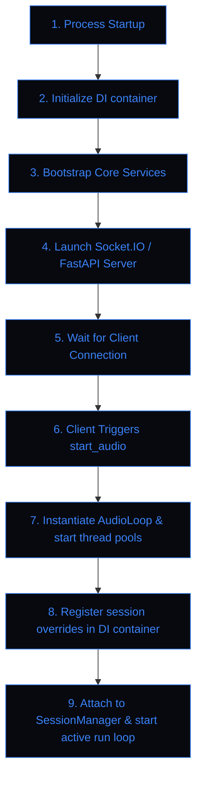

# Lumina V2 Runtime Flow Specification

This document specifies the execution phases of Lumina V2, outlining startup, turn processing, and shutdown flows.

---

## 1. System Lifecycles & Startup Flow

The startup sequence initializes the DI container, spins up the socket server, and prepares background worker tasks.



---

## 2. Interaction Request Cycle

When voice or text input arrives, the system handles it through structured filters, routing, and response streaming.

```mermaid
sequenceDiagram
    autonumber
    actor Client as Frontend Client
    participant Server as server.py
    participant Svc as ServiceAccessor
    participant Pipeline as RequestPipeline
    participant Gemini as Gemini Live Session

    Client->>Server: Send audio frame or text
    alt Text Path
        Server->>Svc: Retrieve project context & memories
        Server->>Pipeline: Execute RequestPipeline middlewares
        Pipeline-->>Server: Continue processing
        Server->>Gemini: Send processed payload
    else Voice Path
        Server->>Loop: Stream raw mic frames to AudioLoop
        Loop->>Gemini: Stream PCM bytes over WebSocket
    end
    Gemini-->>Client: Direct TTS audio stream playback
    Gemini-->>Server: Callback transcription text
    Server->>Svc: Update chat log & run memory extraction
```

---

## 3. Graceful Shutdown Flow

To prevent database corruption and preserve chat history integrity, process shutdowns execute a structured sequence of cleanup events:

```
┌─────────────────────────────────────────────────────────┐
│              1. Trigger Shutdown Event                  │
│     (FastAPI shutdown / manual socket shutdown command) │
└────────────────────────────┬────────────────────────────┘
                             │
                             ▼
┌─────────────────────────────────────────────────────────┐
│              2. Save Session Summary                    │
│     (Writes current context state to SQLite db via _svc)│
└────────────────────────────┬────────────────────────────┘
                             │
                             ▼
┌─────────────────────────────────────────────────────────┐
│              3. Stop AudioLoop Worker                   │
│      (Closes mic streams, stops pyaudio, clears queue)   │
└────────────────────────────┬────────────────────────────┘
                             │
                             ▼
┌─────────────────────────────────────────────────────────┐
│            4. Detach Session Manager                    │
│     (Resets BrainState session flags, clears overrides) │
└────────────────────────────┬────────────────────────────┘
                             │
                             ▼
┌─────────────────────────────────────────────────────────┐
│            5. Terminate Subprocesses                    │
│      (Kills dashboard rules, saves settings.json)       │
└─────────────────────────────────────────────────────────┘
```

---

## 4. Concurrency & Thread-Boundary Regulations

> [!CAUTION]
> **ASYNC COMPATIBILITY**: PyAudio and socket streams execute on background native threads. The main asyncio loop communicates with these threads using thread-safe queues (`asyncio.Queue`) and thread-safe callbacks. Memory access is serialized through SQLite transactional commits.
