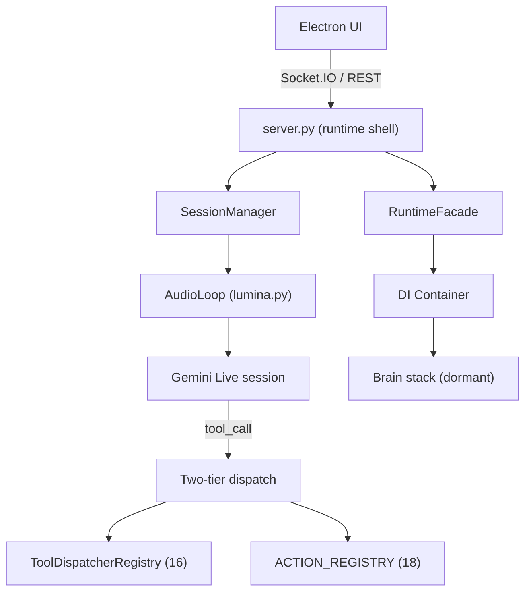
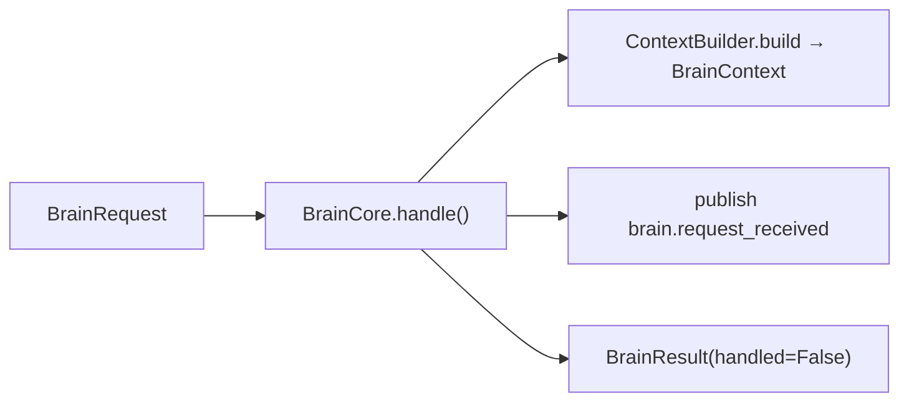
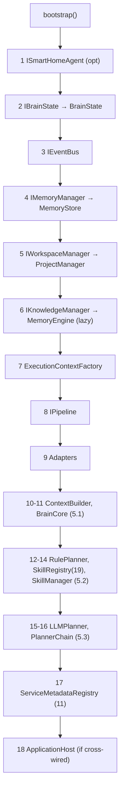
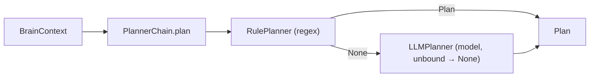
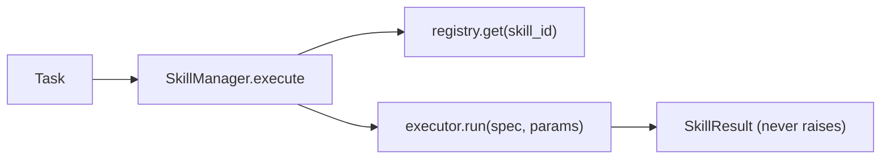
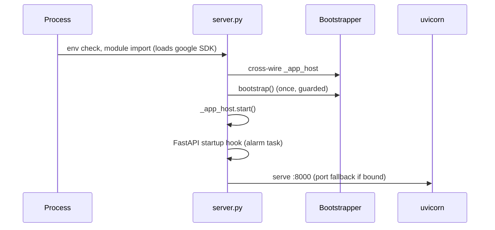
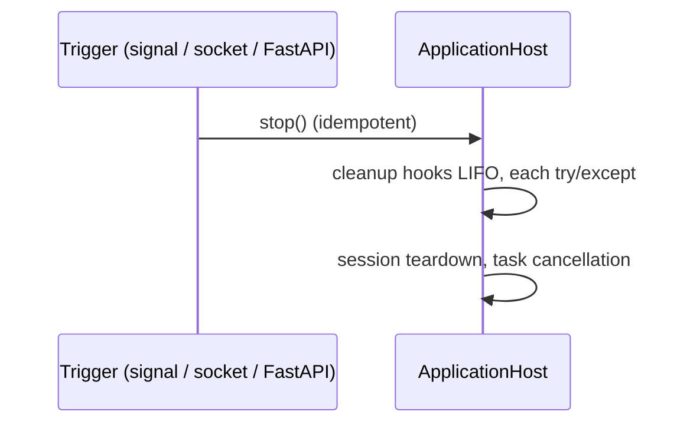
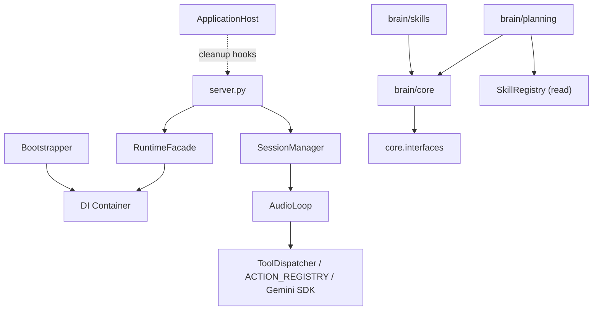

# 01 · Current Architecture

> **Purpose:** Definitive as-built reference for the Lumina platform. Documents every subsystem, its lifecycle, dependencies, invariants, and hidden assumptions.
> **Status:** Verified against code at **Phase 5.4 Step 0** (2026-07-18).
> **Related:** [02 · Analysis](02_ARCHITECTURE_ANALYSIS.md) · [03 · Refactoring Plan](03_REFACTORING_PLAN.md) · [README](README.md)

---

## Executive Summary

Lumina is a local-first voice AI assistant: a FastAPI + Socket.IO backend, an Electron desktop UI, and Google Gemini Live for speech and conversation. The codebase currently contains **two coexisting systems**:

- a **legacy runtime** (`server.py`, `lumina.py`, tool registries) that carries 100% of production traffic; and
- a **cognitive Brain architecture** (`brain/` package) that is fully registered in dependency injection, fully tested, and **inert** — no runtime path invokes it.

The project is mid-migration from the first to the second using a strangler-fig discipline: build dormant, test, wire behind a feature flag, prove equivalence, retire legacy.

---

## Current State

| Layer | Modules | Traffic today |
|---|---|---|
| Runtime shell | `server.py` | 100% |
| Voice pipeline | `lumina.py` (AudioLoop) | 100% voice |
| Legacy dispatch | `core/tool_handlers.py`, `actions/` | 100% tool exec |
| Cognitive layer | `brain/core`, `brain/planning`, `brain/skills` | 0% (dormant) |
| Platform | `core/container.py`, `core/bootstrap.py`, `core/application.py`, `brain/state.py`, `brain/events.py` | supporting |

---

## System Context Diagram



> [!NOTE]
> The left/platform side (RuntimeFacade → Container → Brain) is fully wired for construction but the Brain stack receives no runtime calls. This dormancy is deliberate.

---

## Subsystems

### 1. Runtime Shell — `server.py` (~3,600 lines)

A monolith fusing three responsibilities: User Interaction transport, Session lifecycle, and part of the Tool layer.

**Entry points:**

| Kind | Names |
|---|---|
| Socket.IO | `connect`, `user_input`, `start_audio`, `stop_audio`, `pause/resume`, `confirm_tool`, `shutdown`, ~40 panel-CRUD events |
| REST | `/status`, `/whatsapp_reply`, `/memory/*`, `/local-browser/*`, settings |
| Lifecycle | FastAPI startup/shutdown hooks |
| Background | reminder alarm, persona idle monitor, printer monitor, face-auth, heartbeat |

Only `user_input` (text) and AudioLoop's tool_call loop (voice) execute tools. Runtime state is read live via `_session_mgr.audio_loop`, never cached.

### 2. Dependency Injection — `core/container.py`, `core/services.py`

`DependencyContainer` API: `register_instance` (eager singleton), `register_singleton` (lazy factory), `register_transient`, `resolve`, `is_registered`, `override` (tests). Keys are types/ABCs; duplicate registration raises (enforces one owner per service).

Three access styles coexist: `core/services.py` free functions (pre-Phase-5), `RuntimeFacade` typed properties, and inline container resolves inside facade properties (Phase 5). No caching in the facade.

> [!WARNING]
> **Hidden assumption:** `core/__init__.py` imports `tool_handlers` → `google.genai`. Importing anything from `core` drags the Gemini SDK. Every test mocks `sys.modules['google*']` before importing core.

### 3. EventBus — `brain/events.py`

`InProcessEventBus` implementing `IEventBus`. In-memory pub/sub; dot-topics with `*` single-segment and `**` suffix wildcards; sync + async variants; handler errors isolated. Constructed by Bootstrapper, process lifetime. Usage is sparse; topics are ad-hoc strings (no constants module).

### 4. BrainCore & Cognitive Models — `brain/core/`



Interfaces: `IBrainCore.handle(request) → BrainResult`; `IContextBuilder.build(request) → BrainContext`; `IPlanner.plan(context) → Plan | None`.

Models are frozen, JSON-serializable, callable-free pydantic: `BrainRequest`, `BrainContext`, `Plan`, `Task`, `Reflection`, `BrainResult` (with the load-bearing `handled` flag). ContextBuilder currently enriches only with a `BrainState.get_status()` extract.

**Constraints (test-enforced):** stateless between requests; never executes; never stores; never imports registries/tools/SDKs/server.

### 5. Registries (three — distinct)

| Registry | File | Contents | Signature |
|---|---|---|---|
| `ToolDispatcherRegistry` | `core/tool_handlers.py` | 16 async handlers | `handler(fc, loop)` |
| `ACTION_REGISTRY` | `actions/__init__.py` | 18 sync fns | `fn(params, None, None, memory_store)` |
| `SkillRegistry` | `brain/skills/registry.py` | 19 SkillSpecs (metadata) | brain-side, dormant |

`ServiceMetadataRegistry` (`core/metadata.py`): 11 descriptive records, introspection only.

### 6. Memory — `memory_store.py`, `memory_engine.py`

- **MemoryStore** (`IMemoryManager`): SQLite. Facts/preferences with lifecycle (`pending → active → dormant`), confidence, priority. Also quests/events/notes backing panel CRUD. Fresh connection per method.
- **MemoryEngine** (`IKnowledgeManager`): hybrid vector + keyword retrieval over transcripts, indexing, signal detection. Lazy DI singleton (numpy optional).

> [!WARNING]
> Memory DB is **global** — no per-workspace isolation. Consent state lives on AudioLoop attributes. No dispatchable memory tool exists in either registry.

### 7. Session — `core/session.py`

`SessionManager` owns `audio_loop`, `loop_task`, `authenticator`. Session-scoped state is fragmented across four homes: AudioLoop attributes, the `sio` object (`_ar_last_ids`, dedup hashes), BrainState (`pending_confirmation_id`), and server.py module globals.

**Iron rule:** always read the loop via `_session_mgr.audio_loop` at use time; never cache across `await`.

### 8. Bootstrap — `core/bootstrap.py` (sole composition root)



> [!NOTE]
> **Cross-wire ritual:** `server.py` sets `bootstrapper._app_host = app_host` before `bootstrap()` (circular-import workaround); registration uses `type(self._app_host)` as key.

### 9. Planning — `brain/planning/` (dormant)



- **RulePlanner:** 4 regex rules (nav, memory verbs). Emits retired ids / wrong param shapes (fix pending — see [03](03_REFACTORING_PLAN.md)).
- **LLMPlanner:** injected `IModelGateway` (no implementation → inert). Strict-JSON parse, hallucinated ids unbound, never raises. Contains an `asyncio.run()` call unsafe inside a running loop.
- **PlannerChain:** first-plan-wins. Own DI key; `IPlanner` still binds RulePlanner.

### 10. Skills — `brain/skills/` (dormant)



SkillRegistry seeded with 19 truth-aligned builtins (16 tier-1 + 3 tier-2). LegacyToolExecutor is unbound (`dispatch=None`) today. Since Phase 5.4 Step 0, a pinning test guarantees every `provider_ref` is a real registry key.

### 11. Legacy Dispatch (execution ground truth)

Inside AudioLoop's tool loop:

```
if ToolDispatcherRegistry.contains(fc.name):   # TIER 1
    await handler(fc, self)                     # self = live AudioLoop
elif fc.name in ACTION_REGISTRY:                # TIER 2
    await asyncio.to_thread(fn, dict(fc.args), None, None, self.memory_store)
```

Tier-1 handlers reach into the live loop; tier-2 runs threaded (blocking). Both survive the migration as LegacyToolExecutor's backend.

---

## Lifecycle

### Initialization Order



### Shutdown Order



---

## Dependency Graph



> Acyclic (verified). Rule: `brain/*` never imports `server.py`, `lumina.py`, registries, actions, or model SDKs (AST-enforced).

---

## Invariants

1. Flag OFF ⇒ byte-identical runtime behavior.
2. Bootstrapper is the sole composition root.
3. BrainCore stateless; never executes/stores/imports tools.
4. Planners return data only.
5. Executors and SkillManager never raise — failed `SkillResult` only.
6. One confirmation channel (`_pending_confirmations` + BrainState id).
7. Two-tier dispatch order (tier-1 before tier-2).
8. `brain/*` import whitelist.

---

## Hidden Assumptions (index)

1. `bootstrapper._app_host` attribute injection before bootstrap.
2. `core/__init__` eager Gemini SDK import.
3. Two-tier dispatch order + dual calling conventions.
4. Handlers require the live AudioLoop; `fc` shape `.id/.name/.args`.
5. `_pending_confirmations` + BrainState id = the only confirmation channel.
6. `sio._ar_last_ids` anaphora state outside BrainState.
7. Recursive `_pending_text_queue` flush.
8. Permission tri-state: `True` / `False` / absent.
9. `LLMPlanner` sync path unusable inside a running event loop.
10. RulePlanner output contract not yet aligned to real tools.
11. Memory consent state as AudioLoop attributes.
12. Single-session assumption throughout.
13. `ACTION_REGISTRY` is a live dict view of `ActionRegistry._entries()`.

---

## Dependencies

- **External:** FastAPI, python-socketio, uvicorn, Google Gemini Live SDK (`google.genai`), SQLite, numpy (optional, MemoryEngine), audio/vision native libs.
- **Internal:** all services via DI; `brain/*` depends only on `core.interfaces`.

---

## Risks

Detailed in [02 · Analysis](02_ARCHITECTURE_ANALYSIS.md). Summary: monolithic `server.py`, fragmented session state, global memory DB, sparse/stringly-typed events, and several latent runtime bugs (tool-dispatch gate hole, shutdown disarm, confirmation wedge).

---

## Recommendations

- Treat this document as the onboarding baseline and the invariant reference for all changes.
- Before modifying any subsystem, confirm which of the two systems (legacy vs Brain) it belongs to; legacy is behavior-sacred.
- Proceed with the wiring described in [03 · Refactoring Plan](03_REFACTORING_PLAN.md); do not bypass the flag-gated sequence.
