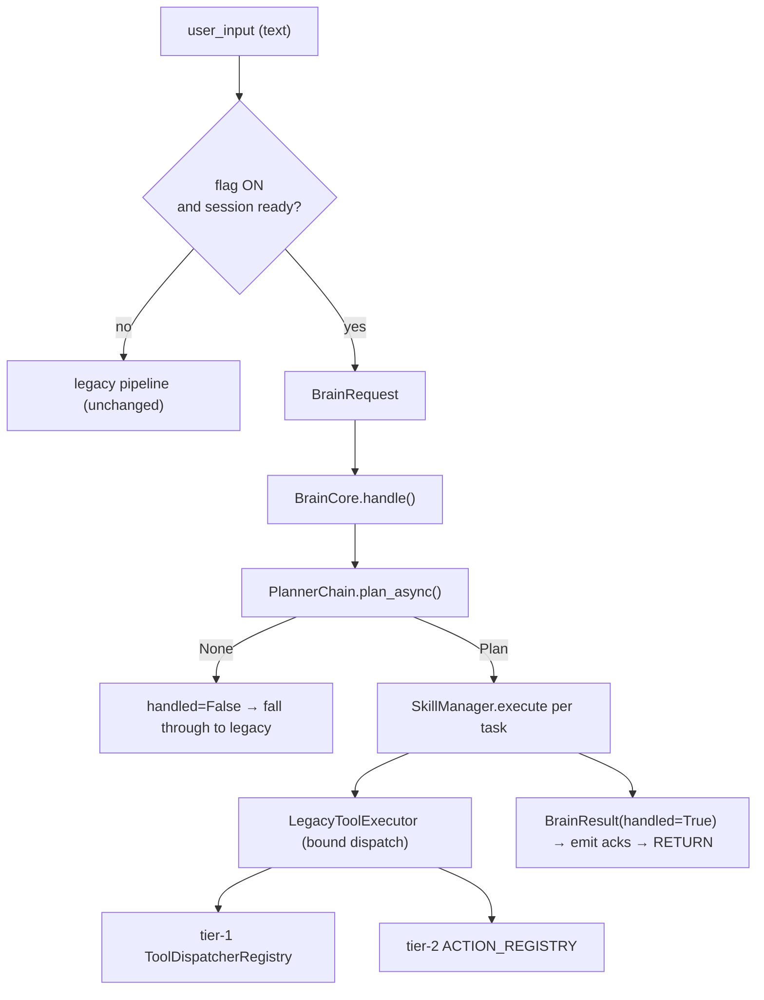
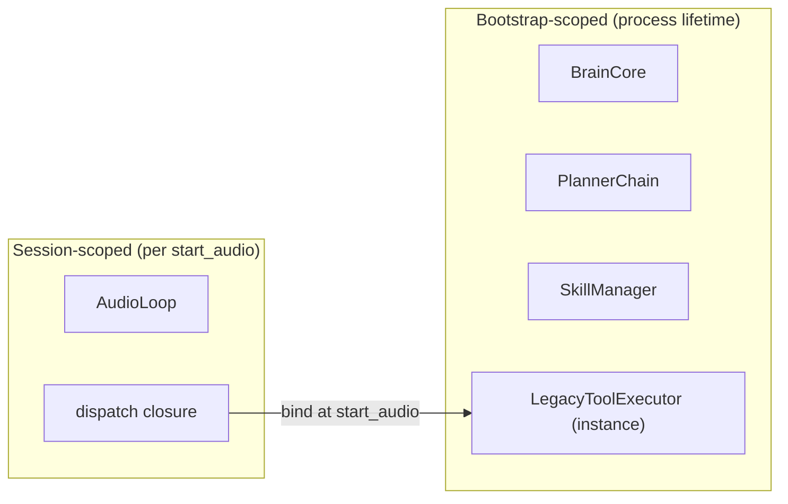
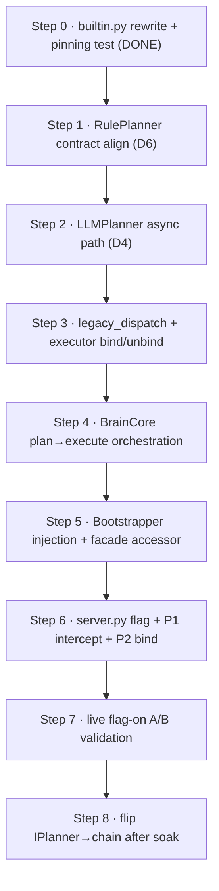

# 03 · Phase 5.4 Integration & Refactoring Plan

> **Purpose:** The approved blueprint for wiring BrainCore into the Lumina runtime while preserving 100% of existing behavior behind a feature flag.
> **Status:** Blueprint approved; **Step 0 complete** (skill catalog truth-alignment). Steps 1–8 pending.
> **Related:** [01 · Current Architecture](01_CURRENT_ARCHITECTURE.md) · [02 · Analysis](02_ARCHITECTURE_ANALYSIS.md) · [05 · Roadmap](05_IMPLEMENTATION_ROADMAP.md) · [README](README.md)

---

## Executive Summary

Phase 5.4 answers one question: *if we wire BrainCore into the runtime, what exactly must happen?* The answer is a strangler-fig migration — the dormant Brain stack is bound to the live runtime behind a `brain_core_enabled` flag (default off), positioned so that flag-off and unrecognized requests fall through to the untouched legacy path. The migration proceeds in eight reversible steps; the sacred files (`server.py`, `lumina.py`) are each edited once.

> [!IMPORTANT]
> **Discrepancies reported before design (code beats docs):**
> - **D1:** the pre-existing skill catalog's `provider_ref`s were fictional — 5 of 7 matched no real registry key. *(Resolved in Step 0.)*
> - **D2:** two incompatible executor calling conventions (`handler(fc, loop)` vs `fn(params, None, None, memory_store)`).
> - **D3:** tool handlers require the live AudioLoop, which exists only after `start_audio` — bootstrap-time dispatch binding is impossible.
> - **D4:** `LLMPlanner._generate_sync` uses `asyncio.run()` — crashes inside a running loop.
> - **D6:** RulePlanner emits retired ids and the wrong param contract for navigation.

---

## Current State

- BrainCore, PlannerChain, RulePlanner, LLMPlanner, SkillRegistry, SkillManager, LegacyToolExecutor: all registered, all dormant.
- LegacyToolExecutor `dispatch=None` (inert). LLMPlanner gateway unbound (inert).
- `IPlanner` binds RulePlanner; PlannerChain has its own DI key.
- Step 0 done: 19 builtins truth-aligned, every `provider_ref` pinned by test to a real registry key.

---

## Target Wiring

> [!NOTE]
> The voice path (`lumina.py` tool loop) is **not touched** in Phase 5.4. Gemini keeps tool selection; voice-path wrapping is a later milestone.

---

## Interception Points

| ID | Location | Role |
|---|---|---|
| **P1** | `server.py` `user_input`, before the nav fast-path, guarded by flag + session check | The only text interception. On `handled=True`, emit and `return`; otherwise fall through to the untouched legacy pipeline. |
| **P2** | `server.py` `start_audio` (after AudioLoop attach) | Bind the session dispatch closure into LegacyToolExecutor; unbind on `stop_audio`/disconnect. |

---

## Session vs Bootstrap Scope

The LegacyToolExecutor **instance** is bootstrap-scoped; its dispatch **binding** is session-scoped. The dispatch closure (new `core/legacy_dispatch.py`) closes over the live AudioLoop and reproduces the two-tier lookup + calling conventions + permission parity.

---

## File-by-File Plan

| File | Change |
|---|---|
| `brain/skills/builtin.py` | *(Step 0, done)* rewritten from live registries; 19 truth-aligned specs. |
| `brain/skills/executors/legacy_tool_executor.py` | Add `bind(dispatch)` / `unbind()`; structure unchanged. |
| `core/legacy_dispatch.py` *(new)* | `build_session_dispatch(audio_loop)` — two-tier closure, permission parity, confirmation refusal. |
| `brain/planning/llm_planner.py` | Async-safe `plan_async()` (fixes D4). |
| `brain/core/brain_core.py` | Extend `handle()`: plan → execute via SkillManager → aggregate BrainResult. |
| `core/bootstrap.py` | Inject planner_chain + skill_manager into BrainCore; expose executor. |
| `core/runtime_facade.py` | Add `legacy_executor` accessor. |
| `server.py` | Flag default-off; P1 intercept; P2 bind/unbind. |
| `brain/planning/rule_planner.py` | Align nav output to `legacy.navigate_ui` + `{panel, view}` (fixes D6). |
| `tests/test_phase_5_4.py` | Grows per step. |

---

## Feature Flag Strategy

- `SETTINGS["brain_core_enabled"]`, default **False**, in `DEFAULT_SETTINGS`, persisted via existing settings load/save.
- Read at request time (no restart to toggle).
- Flag OFF ⇒ one dict lookup then skip ⇒ measured-zero behavior change.

---

## Migration Order (reversible steps)

> [!NOTE]
> Steps 1–5 are pure preparation with zero runtime effect; `server.py` is untouched until Step 6.

---

## Rollback Strategy

Three independent levels:

1. **Runtime:** set `brain_core_enabled = False` — instant, no restart.
2. **Session:** `stop_audio` unbinds dispatch — executor reverts to inert.
3. **Code:** revert one commit — `server.py` diff is ~30 lines in two locations; `brain/*` changes have zero runtime effect with flag off.

---

## Dependencies

- **Blocks on:** D6 (RulePlanner), D4 (LLMPlanner asyncio) — must be fixed before P1 lands.
- **Requires:** live AudioLoop for dispatch binding (P2); existing SkillManager/PlannerChain (registered).

---

## Risks

| Risk | Mitigation |
|---|---|
| Double navigation emission | `handled=True` ⇒ `return`; unrecognized ⇒ Brain emits nothing ⇒ no emission |
| `asyncio.run` crash | Fix D4 before intercept |
| Silent dispatch miss | Step 0 pinning test (done) |
| Nav ack payload drift | A/B assertion vs legacy emissions in tests |
| Executor left bound after disconnect | Unbind in cleanup hook backstop |

---

## Invariants (must never change)

1. Flag OFF ⇒ byte-identical behavior.
2. Voice loop untouched in 5.4.
3. One tool execution per intent (Brain-handled requests `return` before fast-paths).
4. BrainCore stateless; never imports registries/tools/server.
5. Planner never executes.
6. Bootstrapper sole composition root.
7. Executor/manager never raise.
8. `_pending_confirmations` untouched by the Brain path (5.4 refuses instead of confirming).

---

## Recommendations

- Execute strictly in step order; do not stack later steps on unwired scaffolding.
- Fold the related bug fixes ([02](02_ARCHITECTURE_ANALYSIS.md): B3, B4, D7, D19) into Steps 3–6 so sacred files are touched once.
- Defer `server.py` decomposition ([02](02_ARCHITECTURE_ANALYSIS.md) D5) until after Step 7 proves the Brain path.
