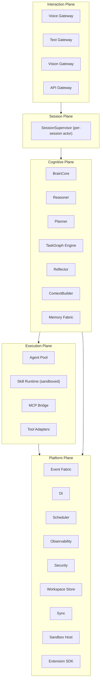
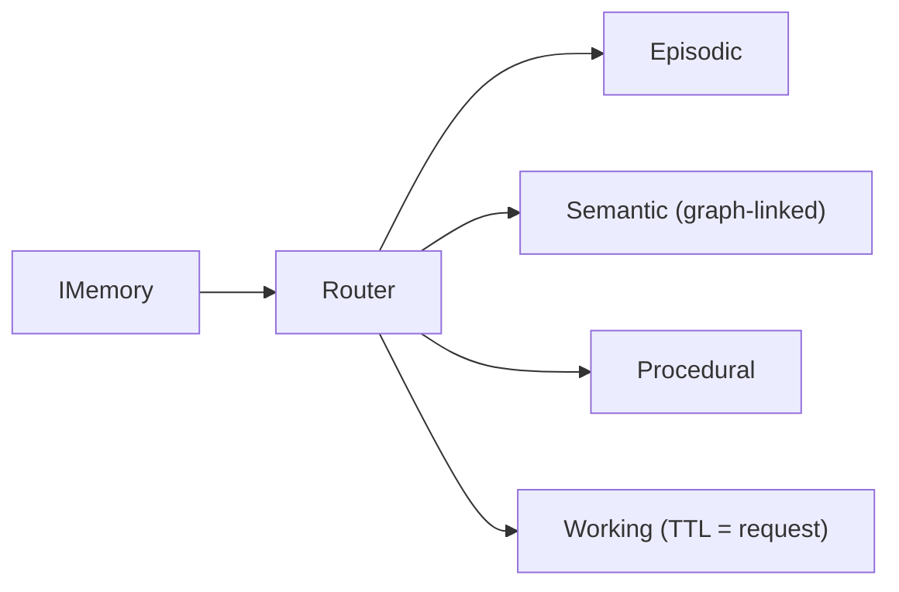
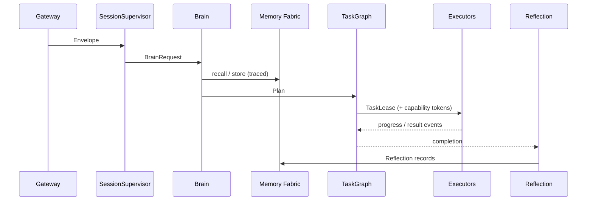

# 04 · Lumina V3 Target Architecture

> **Purpose:** The ideal end-state design for the Lumina platform, assuming unlimited engineering time. Documents the target for every subsystem and states what survives from V2 and what is replaced.
> **Status:** Design target. Not implemented. Reachable from the current system via the [Implementation Roadmap](05_IMPLEMENTATION_ROADMAP.md).
> **Related:** [01 · Current Architecture](01_CURRENT_ARCHITECTURE.md) · [05 · Roadmap](05_IMPLEMENTATION_ROADMAP.md) · [README](README.md)

---

## Executive Summary

V2's lesson: the strangler-fig migration discipline works; the monolith and scattered state fought every step. V3's thesis:

> **Everything is a message on a typed event fabric; everything stateful has exactly one owner; everything executable runs in a sandbox behind a capability token.**

The Brain stays small and stateless forever. Scale comes from adding agents and skills, never from growing the core.

---

## Plane Architecture

**Communication rules:** planes talk downward via typed requests, upward via events only; no plane reaches two planes down; all cross-plane payloads are frozen, serializable, callable-free.

---

## Cognitive Plane

### Brain
- **Keep from V2:** stateless `handle()`, `handled` flag, frozen value objects, "never executes."
- **Replace:** the pass-through skeleton becomes a full pipeline supervisor: understand → recall → reason → plan → execute (delegate) → observe → reflect → respond.

### Reasoning *(new — V2 has none)*
Sits before Planner: intent extraction, ambiguity detection, constraint identification, missing-information detection. Emits `Understanding`; low confidence triggers clarification instead of wrong planning. Tiered: deterministic → model → abstain.

### Planning
- **Keep:** planner-never-executes, first-match chain, hallucinated-reference unbinding, abstain-on-uncertainty.
- **Replace:** flat sequential Plan → **Task Graph**. Planner portfolio (RulePlanner, TemplatePlanner, ModelPlanner) behind `IPlanner`, composed by a MetaPlanner that records which planner won (feeds Reflection).

### Task Graph Engine *(new)*
A Plan compiles to a DAG of Tasks with dependencies, retry policy, timeout, cost estimate, required capabilities, and checkpoints. The engine dispatches ready nodes, persists node state (crash = resume), and supports human-approval nodes (durable, inspectable — replacing V2's ad-hoc futures map).

### Reflection *(V2 dormant → active)*
After each graph: collect metrics, root-cause failures, detect recurring workflows (→ TemplatePlanner), detect skill gaps (→ Skill Foundry). Output = records into Memory, never direct behavior change.

### ContextBuilder
- **Keep:** read-only, failure-safe, frozen output.
- **Replace:** empty enrichment with a real, traced, token-budgeted assembly pipeline.

---

## Memory Fabric

- **Keep:** lifecycle `pending → active → dormant`, consent-gated promotion.
- **New:** relationship graph, conflict detection, retrieval budgeting with provenance, decay + revisit as a background job.
- **Workspace-scoped by construction** — fixes V2's global-DB violation at the schema level.

---

## Execution Plane

### Agents & Multi-Agent Collaboration *(new)*
Specialized executors (Coder, Researcher, Browser, Desktop, Memory-Curator, Reflection). **Coordination medium is the Task Graph** — agents claim nodes and post results; they do not free-form chat (avoids unbounded token burn). An agent is an executor whose `run()` spawns a model loop inside a sandbox with a capability token.

### Skill Runtime & Plugin System
- **Keep:** SkillSpec metadata registry, provider-matched executors, truth-pinning (made a registration-time check), never-raise SkillResults.
- **Replace:** hardcoded builtin lists → a **package format** (manifest, entry point, tests, sandbox profile), discovered/validated/approved/versioned with rollback. Providers: `python`, `mcp`, `native` (legacy retirement home), `agent`, `remote`.

### Skill Foundry *(new)*
Reflection detects a gap → drafts a skill package → sandbox test → static analysis → user approval → registry. The Brain never modifies skills.

### MCP Bridge *(new)*
Mounts MCP servers as skill providers (auto-registered SkillSpecs); Lumina also exposes its own MCP server.

### Tool Sandboxing *(new)*
Every non-native execution runs in a sandbox: filesystem scoped to workspace, network allowlist from the grant, CPU/memory/time limits, no ambient credentials.

### Distributed Execution *(new)*
Task Graph nodes carry placement hints; a WorkDispatcher routes local-fast / local-heavy / remote. Local-first kept; remote opt-in per capability.

---

## Interaction Plane

- **Voice:** keep Gemini Live (swappable via `IVoiceGateway`); voice-selected tool calls enter as pre-planned single-node graphs (`channel=voice_tool`, planning skipped) so permissioning/sandboxing/observability still apply.
- **Text:** V2's three fast-paths dissolve; text → Envelope → Brain. RulePlanner absorbs the deterministic grammars as rule packs (one grammar, one owner).
- **Browser / Desktop:** agent + skill-pack pairs, not runtime features.
- **API integrations:** MCP servers or skill packages; no integration code in the platform.

---

## Platform Plane

| Subsystem | Keep | Replace / Add |
|---|---|---|
| Event Fabric | wildcard pub/sub | typed topic registry (versioned), persistent journal |
| DI | single root, lazy factories, test overrides | scopes (process/session/request), mandatory interfaces |
| Configuration | — | layered typed config, validated at boot, flags with expiry |
| Scheduling | — | one supervised Scheduler (cron + one-shot), replaces scattered loops |
| Observability | ExecutionContext trace id | spans, structured logs with redaction, metrics, local dashboard |
| Testing | phase-gated regression, truth-pinning, AST boundaries | pytest + conftest + CI, contract tests, replay tests, chaos tests |
| Security | tri-state approval UX | **capability tokens**, secret broker, audit log |
| Workspace | — | isolation as the unit of tenancy (memory/files/skills/embeddings) |
| Sync | — | optional E2E-encrypted per-workspace replication |
| Extension SDK | — | package format + typed client libs + dev harness + conformance suite |

---

## Communication Summary

---

## What Survives V2, What Dies

> [!NOTE]
> **Survives (proven):** DI container + single composition root; ApplicationHost LIFO lifecycle; BrainState transactional snapshot pattern; stateless BrainCore + `handled` fallback; planner abstain-chain; SkillSpec/SkillResult contracts; truth-pinning; never-raise results; memory lifecycle + consent; voice-model-decides-tools seam; flag-gated strangler discipline; AST-enforced import boundaries; the test culture.

> [!WARNING]
> **Replaced:** `server.py` monolith → gateways + SessionSupervisor; three text fast-paths → one Reasoner/RulePlanner; two legacy registries → skill packages (legacy lives inside the `native` provider until re-homed); boolean permissions → capability tokens; futures-map confirmations → durable approval nodes; scattered session state → session-scoped DI; print logging → structured observability; stringly topics → typed registry; unsupervised loops → Scheduler; in-process everything → sandboxes; `core/__init__` SDK entanglement → removed by construction.

---

## Dependencies

The keystone is the **Task Graph Engine**: agents, sandboxing, approvals, distribution, and reflection all attach to it. Build it first among the new subsystems.

---

## Risks

- V3 is large; the only safe path is the same strangler-fig doctrine that reached V2 — each plane built dormant, flag-gated, proven equivalent, then legacy retired.
- Attempting V3 as a rewrite (rather than incremental) contradicts the project's governing discipline and is out of scope.

---

## Recommendations

- Treat V3 as direction, not a work order. Concrete near-term work is [03 · Refactoring Plan](03_REFACTORING_PLAN.md).
- Sequence new subsystems per [05 · Implementation Roadmap](05_IMPLEMENTATION_ROADMAP.md); the critical path runs through the Scheduler and Task Graph engine.
