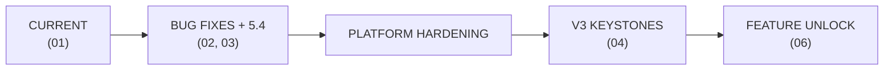
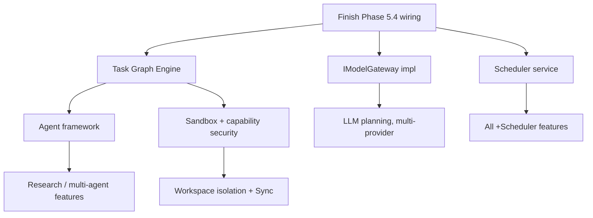

# 05 · Implementation Roadmap

> **Purpose:** The ordered engineering path from the current system, through the flag-gated refactor, toward the V3 target. Consolidates the debt-fix ordering, the Phase 5.4 step sequence, and the V3 dependency critical path.
> **Status:** Phase 5.4 Step 0 complete.
> **Related:** [02 · Analysis](02_ARCHITECTURE_ANALYSIS.md) · [03 · Refactoring Plan](03_REFACTORING_PLAN.md) · [04 · V3](04_V3_ARCHITECTURE.md) · [06 · Future Features](06_FUTURE_FEATURES.md) · [README](README.md)

---

## Executive Summary

The roadmap has three horizons:

1. **Near-term (weeks):** fix release-blocking bugs, finish wiring the Brain into the runtime (Phase 5.4).
2. **Mid-term (months):** harden the platform (interfaces, permissions, observability, scheduler), consolidate session state.
3. **Long-term (quarters):** build the V3 keystones (Task Graph, agents, sandbox, workspace isolation, sync).

> [!IMPORTANT]
> Every step preserves working behavior and is reversible. Structural moves (monolith decomposition, workspace isolation) come **last**, only on a proven Brain path.

---

## Evolution Overview

---

## Horizon 1 — Near-Term (Debt + Phase 5.4)

Combined ordering of the debt register and the Phase 5.4 step sequence.

| Order | Work | Source | Effort |
|---|---|---|---|
| 1 | **B1** dispatch gate hole + **B2** shutdown disarm (hotfix — break current behavior) | [02](02_ARCHITECTURE_ANALYSIS.md) | Low |
| 2 | **Step 1** RulePlanner contract align (D6) | [03](03_REFACTORING_PLAN.md) | Low |
| 3 | **Step 2** LLMPlanner async path (D1/D4) | [03](03_REFACTORING_PLAN.md) | Low |
| 4 | **D2** `core/__init__` SDK import removal | [02](02_ARCHITECTURE_ANALYSIS.md) | Low-Med |
| 5 | pytest provisioning + conftest + set-based assertions (D14–D16) | [02](02_ARCHITECTURE_ANALYSIS.md) | Med |
| 6 | **Step 3** dispatch closure + executor bind/unbind, bundling **B3/B4** confirmation teardown, **D7** session-generation check, **B8/D19** MemoryStore thread-safety audit | [03](03_REFACTORING_PLAN.md) | Med |
| 7 | **Step 4–5** BrainCore orchestration + Bootstrapper injection + facade accessor | [03](03_REFACTORING_PLAN.md) | Med |
| 8 | **Step 6** server.py flag + P1 intercept + P2 bind, bundling **B11** queue cap/iterative flush, **D18** `_app_host` constructor param, **B10** uvicorn exit | [03](03_REFACTORING_PLAN.md) | Med |
| 9 | **Step 7** live flag-on A/B validation | [03](03_REFACTORING_PLAN.md) | Low |
| 10 | **Step 8** flip `IPlanner` → PlannerChain after soak | [03](03_REFACTORING_PLAN.md) | Low |

> [!NOTE]
> Steps 1–5 of Phase 5.4 are pure preparation (zero runtime effect). `server.py` is edited once (order 8).

---

## Horizon 2 — Mid-Term (Platform Hardening)

| Order | Work | Source | Effort |
|---|---|---|---|
| 11 | Skill-layer ABCs — `ISkillRegistry` / `ISkillManager` / `ISkillExecutor` (D10) | [02](02_ARCHITECTURE_ANALYSIS.md) | Low |
| 12 | Session-state consolidation, incremental (D8, D12, D20, B12) | [02](02_ARCHITECTURE_ANALYSIS.md) | Med-High |
| 13 | Event topic constants (D11) + background-loop supervision (D26, B5, B6) | [02](02_ARCHITECTURE_ANALYSIS.md) | Low-Med |
| 14 | SkillManager permission enforcement (D13) | [02](02_ARCHITECTURE_ANALYSIS.md) | Low-Med |
| 15 | `IModelGateway` implementation (binds LLMPlanner) | [04](04_V3_ARCHITECTURE.md) | Med |
| 16 | Scheduler service (replaces scattered loops) | [04](04_V3_ARCHITECTURE.md) | L |

---

## Horizon 3 — Long-Term (V3 Keystones)

| Order | Work | Unlocks | Effort |
|---|---|---|---|
| 17 | **Task Graph Engine** (keystone) | multi-step, agents, research | L-XL |
| 18 | Agent framework (on Task Graph) | Coder/Research/Browser agents | XL |
| 19 | Sandbox host + capability security | safe skills, enterprise | XL |
| 20 | Workspace isolation (D17) | research workspaces, team | High |
| 21 | Sync (E2E-encrypted) | multi-device, enterprise | XL |
| 22 | `server.py` decomposition (D5) | maintainability | High |

---

## Dependency Critical Path

> [!TIP]
> **Highest leverage:** the **Scheduler** and **Task Graph Engine** — cheap-to-medium relative to how many features they gate. **Agents** and **sandbox** are the expensive unlocks.

---

## Milestone Gate (definition of done — unchanged project discipline)

Every milestone ships with:

- its phase test file (`test_phase_X_Y.py`),
- full regression (all Phase 4, all Phase 5, core 1_4–1_8, brain 2_1/3),
- a live boot check (`/status` 200, single bootstrap, zero tracebacks, expected `[DI]` lines).

---

## Dependencies

- Horizon 1 blocks Horizon 2 (a proven Brain path is required before hardening its consumers).
- Horizon 2's Scheduler and Horizon 3's Task Graph are prerequisites for the bulk of [06 · Future Features](06_FUTURE_FEATURES.md).

---

## Risks

- Skipping the bug-fix hotfix (order 1) ships known-broken behavior into the wiring milestone.
- Building agents or features before the Task Graph engine repeats V2's "scaffolding without traffic" anti-pattern.

---

## Recommendations

- Execute Horizon 1 in strict order; it is the approved, reversible path.
- Treat Horizons 2–3 as directional; re-plan each on completion of the prior horizon.
- Use [06 · Future Features](06_FUTURE_FEATURES.md) to prioritize which keystone to build first based on desired feature unlocks.
