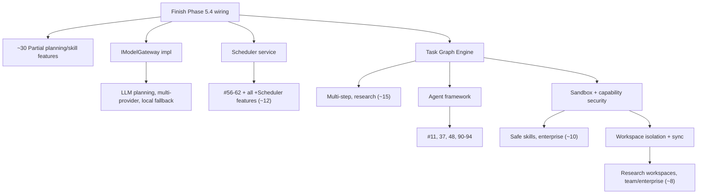

# 06 · Future Feature Catalog

> **Purpose:** Roadmap catalog of 100 candidate features for the Lumina platform, grouped by domain. Each entry records difficulty, estimated effort, dependencies, and current support level. This document catalogs proposals; it does not commit to implementing them.
> **Status:** Catalog. Support levels assessed against the current architecture ([01](01_CURRENT_ARCHITECTURE.md)) and V3 target ([04](04_V3_ARCHITECTURE.md)).
> **Related:** [04 · V3](04_V3_ARCHITECTURE.md) · [05 · Roadmap](05_IMPLEMENTATION_ROADMAP.md) · [README](README.md)

---

## Legend

- **Difficulty:** S (small) · M (medium) · L (large) · XL (extra-large)
- **Effort:** rough engineering-weeks
- **Support:** **Yes** (arch ready now) · **Partial** (needs Brain wiring or one subsystem) · **No** (needs a new subsystem)

---

## Productivity

### 1. Smart daily briefing
- **Description:** Morning summary of calendar, quests, unread items.
- **Difficulty:** M · **Effort:** 3w
- **Dependencies:** Scheduler, calendar skill
- **Support:** Partial (no scheduler)
- **Notes:** Subsystem: Skills + Memory + Scheduler.

### 2. Meeting note capture
- **Description:** Transcribe and summarize a meeting into a note.
- **Difficulty:** M · **Effort:** 3w
- **Dependencies:** transcription (exists)
- **Support:** Partial
- **Notes:** Subsystem: Voice + Memory.

### 3. Email triage
- **Description:** Classify/summarize inbox, draft replies.
- **Difficulty:** L · **Effort:** 5w
- **Dependencies:** email MCP, planner wired
- **Support:** Partial
- **Notes:** Subsystem: Skills (MCP) + Planning.

### 4. Task inbox / GTD
- **Description:** Capture → clarify → quest workflow.
- **Difficulty:** S · **Effort:** 2w
- **Dependencies:** quest store (exists)
- **Support:** **Yes**
- **Notes:** Rides existing panel-CRUD.

### 5. Recurring reminders (natural language)
- **Description:** "remind me every Tuesday."
- **Difficulty:** M · **Effort:** 2w
- **Dependencies:** Scheduler
- **Support:** Partial

### 6. Clipboard history + recall
- **Description:** Store clipboard entries with semantic recall.
- **Difficulty:** M · **Effort:** 3w
- **Dependencies:** desktop action, MemoryEngine
- **Support:** Partial

### 7. Focus mode
- **Description:** Mute notifications and block apps for a duration.
- **Difficulty:** M · **Effort:** 2w
- **Dependencies:** `desktop_control`, Scheduler
- **Support:** Partial

### 8. Weekly review generator
- **Description:** Reflect on completed quests over the week.
- **Difficulty:** M · **Effort:** 3w
- **Dependencies:** Reflection engine
- **Support:** No (reflection dormant)

---

## Coding

### 9. Repo Q&A
- **Description:** Answer questions over a codebase.
- **Difficulty:** L · **Effort:** 5w · **Dependencies:** MemoryEngine indexing · **Support:** Partial

### 10. PR review assistant
- **Description:** Summarize and comment on diffs.
- **Difficulty:** L · **Effort:** 5w · **Dependencies:** GitHub MCP · **Support:** Partial

### 11. Test generator
- **Description:** Draft tests for a file.
- **Difficulty:** L · **Effort:** 5w · **Dependencies:** Coder agent · **Support:** No (no agents)

### 12. Refactor executor
- **Description:** Multi-file rename/extract.
- **Difficulty:** XL · **Effort:** 8w · **Dependencies:** Task Graph, sandbox · **Support:** No

### 13. Build/run + fix loop
- **Description:** Run build, parse errors, patch iteratively.
- **Difficulty:** XL · **Effort:** 8w · **Dependencies:** sandbox, Task Graph · **Support:** No

### 14. Commit message generator
- **Description:** Draft from staged diff.
- **Difficulty:** S · **Effort:** 1w · **Dependencies:** git skill · **Support:** **Yes** (native adapter)

### 15. Dependency auditor
- **Description:** Scan dependencies for CVEs.
- **Difficulty:** M · **Effort:** 3w · **Dependencies:** scan skill · **Support:** Partial

### 16. Docstring / README generator
- **Description:** Generate docs from code.
- **Difficulty:** M · **Effort:** 3w · **Dependencies:** Coder agent · **Support:** No

---

## AI

### 17. Model gateway (multi-provider)
- **Description:** Swap Gemini/other behind `IModelGateway`.
- **Difficulty:** M · **Effort:** 3w · **Dependencies:** — · **Support:** Partial (interface exists, unbound)

### 18. Local LLM fallback
- **Description:** Offline model when no cloud.
- **Difficulty:** L · **Effort:** 5w · **Dependencies:** gateway · **Support:** Partial

### 19. Prompt / persona profiles
- **Description:** Switchable system personas.
- **Difficulty:** S · **Effort:** 2w · **Dependencies:** — · **Support:** **Yes**

### 20. Cost / token budget guard
- **Description:** Cap spend per session.
- **Difficulty:** M · **Effort:** 3w · **Dependencies:** metrics · **Support:** No (no metrics)

### 21. Self-critique before act
- **Description:** Validate a plan pre-execution.
- **Difficulty:** L · **Effort:** 5w · **Dependencies:** Reasoner · **Support:** No

### 22. Confidence-gated clarification
- **Description:** Ask the user when intent is uncertain.
- **Difficulty:** M · **Effort:** 3w · **Dependencies:** Reasoner stage · **Support:** No

### 23. Adaptive planner selection
- **Description:** Pick a planner by task complexity.
- **Difficulty:** M · **Effort:** 3w · **Dependencies:** PlannerChain · **Support:** Partial

### 24. Response streaming
- **Description:** Progressive partial replies.
- **Difficulty:** M · **Effort:** 3w · **Dependencies:** event fabric · **Support:** Partial

---

## Desktop Automation

### 25. App launcher (NL)
- **Description:** "open Blender." · **Difficulty:** S · **Effort:** 0.5w · **Dependencies:** `open_app` (exists) · **Support:** **Yes**

### 26. Window tiling / layout
- **Description:** Arrange windows by voice. · **Difficulty:** M · **Effort:** 3w · **Dependencies:** window control · **Support:** Partial

### 27. File organizer
- **Description:** Sort downloads by rules. · **Difficulty:** M · **Effort:** 3w · **Dependencies:** `file_controller` · **Support:** **Yes**

### 28. Screen macro record/replay
- **Description:** Record clicks, replay. · **Difficulty:** L · **Effort:** 6w · **Dependencies:** input capture · **Support:** No

### 29. OCR-driven click
- **Description:** Find text on screen and click it. · **Difficulty:** L · **Effort:** 5w · **Dependencies:** vision OCR · **Support:** Partial

### 30. System settings by voice
- **Description:** Volume/brightness/wifi. · **Difficulty:** S · **Effort:** 1w · **Dependencies:** `computer_settings` (exists) · **Support:** **Yes**

### 31. Batch file rename
- **Description:** Pattern rename via NL. · **Difficulty:** M · **Effort:** 2w · **Dependencies:** file action · **Support:** **Yes**

### 32. Cross-app workflow
- **Description:** "screenshot → annotate → email." · **Difficulty:** XL · **Effort:** 8w · **Dependencies:** Task Graph, sandbox · **Support:** No

---

## Browser Automation

### 33. NL web navigation
- **Description:** "go to my GitHub PRs." · **Difficulty:** M · **Effort:** 3w · **Dependencies:** local browser · **Support:** **Yes**

### 34. Form autofill
- **Description:** Fill forms from memory/profile. · **Difficulty:** M · **Effort:** 4w · **Dependencies:** browser, memory · **Support:** Partial

### 35. Web scraping to memory
- **Description:** Extract page, index it. · **Difficulty:** M · **Effort:** 4w · **Dependencies:** indexing · **Support:** Partial

### 36. Price / stock watcher
- **Description:** Poll page, alert on change. · **Difficulty:** M · **Effort:** 4w · **Dependencies:** Scheduler · **Support:** Partial

### 37. Multi-tab research session
- **Description:** Open N sources, synthesize. · **Difficulty:** L · **Effort:** 6w · **Dependencies:** Research agent · **Support:** No

### 38. Login / session vault
- **Description:** Reuse authed sessions safely. · **Difficulty:** L · **Effort:** 6w · **Dependencies:** secret broker · **Support:** No

### 39. Screenshot + summarize page
- **Description:** Capture and describe. · **Difficulty:** M · **Effort:** 3w · **Dependencies:** vision · **Support:** Partial

### 40. Recorded browser flows
- **Description:** Replay saved web tasks. · **Difficulty:** L · **Effort:** 6w · **Dependencies:** flow recorder · **Support:** No

---

## Home Automation

### 41. Scene control
- **Description:** "movie mode" = multi-device. · **Difficulty:** M · **Effort:** 2w · **Dependencies:** Kasa agent · **Support:** **Yes**

### 42. Schedule-based lighting
- **Description:** Sunset auto-on. · **Difficulty:** M · **Effort:** 2w · **Dependencies:** Scheduler · **Support:** Partial

### 43. Presence-based automation
- **Description:** Home/away triggers. · **Difficulty:** L · **Effort:** 5w · **Dependencies:** presence source · **Support:** Partial

### 44. Voice device grouping
- **Description:** "living room lights." · **Difficulty:** S · **Effort:** 2w · **Dependencies:** device aliases · **Support:** **Yes**

### 45. Energy usage report
- **Description:** Track device on-time. · **Difficulty:** M · **Effort:** 3w · **Dependencies:** metrics · **Support:** Partial

### 46. Non-Kasa integration (MQTT / Home Assistant)
- **Description:** Support additional ecosystems. · **Difficulty:** L · **Effort:** 5w · **Dependencies:** MCP bridge · **Support:** Partial

### 47. Routine chaining
- **Description:** "goodnight" runs a sequence. · **Difficulty:** M · **Effort:** 3w · **Dependencies:** Task Graph · **Support:** Partial

---

## Research

### 48. Multi-source report
- **Description:** Fan-out search, synthesize, cite. · **Difficulty:** XL · **Effort:** 8w · **Dependencies:** Research agent, Task Graph · **Support:** No

### 49. Citation manager
- **Description:** Track sources per claim. · **Difficulty:** M · **Effort:** 4w · **Dependencies:** knowledge graph · **Support:** Partial

### 50. Literature summarizer
- **Description:** PDF → structured notes. · **Difficulty:** L · **Effort:** 5w · **Dependencies:** PDF/OCR · **Support:** Partial

### 51. Fact verification
- **Description:** Cross-check claims. · **Difficulty:** L · **Effort:** 6w · **Dependencies:** verify agent · **Support:** No

### 52. Research workspace
- **Description:** Isolated project knowledge. · **Difficulty:** L · **Effort:** 6w · **Dependencies:** workspace stores · **Support:** No (global memory)

### 53. Auto-brief on topic
- **Description:** Daily digest on saved topics. · **Difficulty:** M · **Effort:** 4w · **Dependencies:** Scheduler · **Support:** Partial

### 54. Compare-sources table
- **Description:** Structured multi-source diff. · **Difficulty:** L · **Effort:** 5w · **Dependencies:** research agent, dataviz · **Support:** No

### 55. Knowledge gap finder
- **Description:** "what am I missing." · **Difficulty:** L · **Effort:** 6w · **Dependencies:** Reflection · **Support:** No

---

## Scheduling

### 56. Central scheduler service
- **Description:** Cron + one-shot + supervised jobs. · **Difficulty:** L · **Effort:** 5w · **Dependencies:** — · **Support:** No (loops scattered)

### 57. NL scheduling
- **Description:** "every weekday 9am." · **Difficulty:** M · **Effort:** 3w · **Dependencies:** Scheduler · **Support:** No

### 58. Deferred task execution
- **Description:** Run a graph later. · **Difficulty:** L · **Effort:** 6w · **Dependencies:** Task Graph, Scheduler · **Support:** No

### 59. Calendar sync
- **Description:** Two-way calendar. · **Difficulty:** M · **Effort:** 4w · **Dependencies:** calendar MCP · **Support:** Partial

### 60. Snooze / reschedule
- **Description:** Move reminders. · **Difficulty:** S · **Effort:** 2w · **Dependencies:** Scheduler · **Support:** Partial

### 61. Timezone-aware alarms
- **Description:** Correct across travel. · **Difficulty:** M · **Effort:** 2w · **Dependencies:** Scheduler · **Support:** No

### 62. Background job dashboard
- **Description:** See running jobs. · **Difficulty:** M · **Effort:** 3w · **Dependencies:** Observability · **Support:** No

---

## Learning

### 63. Spaced-repetition tutor
- **Description:** Flashcards from notes. · **Difficulty:** M · **Effort:** 4w · **Dependencies:** Scheduler · **Support:** Partial

### 64. Explain-my-code
- **Description:** Teach a codebase interactively. · **Difficulty:** M · **Effort:** 3w · **Dependencies:** repo index · **Support:** Partial

### 65. Skill-progress tracking
- **Description:** Track what the user learned. · **Difficulty:** M · **Effort:** 3w · **Dependencies:** procedural memory · **Support:** Partial

### 66. Quiz generator
- **Description:** Make quizzes from material. · **Difficulty:** M · **Effort:** 2w · **Dependencies:** — · **Support:** **Yes**

### 67. Adaptive difficulty
- **Description:** Adjust to user level. · **Difficulty:** L · **Effort:** 5w · **Dependencies:** Reflection · **Support:** No

### 68. Language practice
- **Description:** Conversational drills. · **Difficulty:** M · **Effort:** 3w · **Dependencies:** persona profiles · **Support:** Partial

### 69. Learning journal
- **Description:** Auto-log study sessions. · **Difficulty:** M · **Effort:** 3w · **Dependencies:** Reflection · **Support:** Partial

---

## Personal Knowledge

### 70. Personal wiki
- **Description:** Interlinked notes with a graph. · **Difficulty:** L · **Effort:** 6w · **Dependencies:** knowledge graph · **Support:** Partial

### 71. "What did I say about X"
- **Description:** Semantic recall over history. · **Difficulty:** M · **Effort:** 3w · **Dependencies:** indexing · **Support:** **Yes**

### 72. Contact memory
- **Description:** Remember people and context. · **Difficulty:** M · **Effort:** 3w · **Dependencies:** — · **Support:** Partial

### 73. Preference learning
- **Description:** Auto-learn habits. · **Difficulty:** L · **Effort:** 5w · **Dependencies:** Reflection · **Support:** No

### 74. Document ingestion
- **Description:** Drop a file → indexed knowledge. · **Difficulty:** M · **Effort:** 4w · **Dependencies:** OCR, indexing · **Support:** Partial

### 75. Conflict detection
- **Description:** Flag contradicting facts. · **Difficulty:** L · **Effort:** 5w · **Dependencies:** knowledge graph · **Support:** No

### 76. Memory export / import
- **Description:** Own your data. · **Difficulty:** M · **Effort:** 3w · **Dependencies:** — · **Support:** Partial

---

## Vision

### 77. Screenshot understanding
- **Description:** Describe/act on the screen. · **Difficulty:** L · **Effort:** 5w · **Dependencies:** vision gateway · **Support:** Partial

### 78. OCR anywhere
- **Description:** Extract text from image/screen. · **Difficulty:** M · **Effort:** 3w · **Dependencies:** OCR · **Support:** Partial

### 79. Webcam presence / auth
- **Description:** Face auth (exists), expanded. · **Difficulty:** M · **Effort:** 2w · **Dependencies:** authenticator · **Support:** **Yes**

### 80. Diagram interpretation
- **Description:** Read flowcharts/UML. · **Difficulty:** L · **Effort:** 6w · **Dependencies:** vision + Reasoner · **Support:** No

### 81. Visual CAD feedback
- **Description:** Inspect a generated model. · **Difficulty:** L · **Effort:** 6w · **Dependencies:** CAD, vision · **Support:** Partial

### 82. Receipt / document scan
- **Description:** Structured extraction. · **Difficulty:** M · **Effort:** 4w · **Dependencies:** OCR · **Support:** Partial

### 83. Screen-change watcher
- **Description:** Alert on visual change. · **Difficulty:** L · **Effort:** 5w · **Dependencies:** Scheduler · **Support:** No

---

## Voice

### 84. Wake word
- **Description:** Hands-free activation. · **Difficulty:** M · **Effort:** 4w · **Dependencies:** wake engine · **Support:** Partial

### 85. Speaker ID
- **Description:** Distinguish users. · **Difficulty:** L · **Effort:** 6w · **Dependencies:** voice embeddings · **Support:** No

### 86. Voice profiles / preferences
- **Description:** Per-speaker settings. · **Difficulty:** M · **Effort:** 3w · **Dependencies:** speaker ID · **Support:** No

### 87. Barge-in improvement
- **Description:** Better interruption handling. · **Difficulty:** M · **Effort:** 3w · **Dependencies:** existing mic gate · **Support:** Partial

### 88. Multilingual voice
- **Description:** Detect and respond in language. · **Difficulty:** M · **Effort:** 3w · **Dependencies:** Gemini support · **Support:** Partial

### 89. Offline voice fallback
- **Description:** Local STT/TTS when no network. · **Difficulty:** XL · **Effort:** 8w · **Dependencies:** local models · **Support:** No

---

## Agents

### 90. Agent framework
- **Description:** Spawnable specialized executors. · **Difficulty:** XL · **Effort:** 10w · **Dependencies:** Task Graph, sandbox · **Support:** No

### 91. Manager agent
- **Description:** Coordinate multi-agent graphs. · **Difficulty:** XL · **Effort:** 8w · **Dependencies:** agent framework · **Support:** No

### 92. Browser agent
- **Description:** Autonomous web tasks. · **Difficulty:** L · **Effort:** 6w · **Dependencies:** agent framework · **Support:** No

### 93. Coder agent
- **Description:** Autonomous code tasks. · **Difficulty:** XL · **Effort:** 8w · **Dependencies:** sandbox · **Support:** No

### 94. Agent handoff protocol
- **Description:** Pass work between agents. · **Difficulty:** L · **Effort:** 6w · **Dependencies:** Task Graph · **Support:** No

---

## Security

### 95. Capability-token permissions
- **Description:** Replace the boolean permission dict. · **Difficulty:** XL · **Effort:** 8w · **Dependencies:** — · **Support:** No (boolean today)

### 96. Skill sandboxing
- **Description:** Isolate skill execution. · **Difficulty:** XL · **Effort:** 10w · **Dependencies:** package format · **Support:** No

### 97. Secret broker
- **Description:** Encrypted credentials, short-lived injection. · **Difficulty:** L · **Effort:** 6w · **Dependencies:** — · **Support:** No

---

## Enterprise

### 98. Audit log
- **Description:** Append-only action record. · **Difficulty:** M · **Effort:** 4w · **Dependencies:** structured logging · **Support:** No

### 99. Multi-device sync
- **Description:** E2E-encrypted workspace sync. · **Difficulty:** XL · **Effort:** 10w · **Dependencies:** workspace isolation · **Support:** No

### 100. Team workspaces
- **Description:** Shared project knowledge. · **Difficulty:** XL · **Effort:** 12w · **Dependencies:** isolation, sync, capabilities · **Support:** No

---

## Current Capability Summary

| Support level | Count | Character |
|---|---|---|
| **Yes** (ready now) | 13 | Skill/action + memory + panel-CRUD features on existing legacy registries: #4, 14, 19, 25, 27, 30, 31, 33, 41, 44, 66, 71, 79 |
| **Partial** (one unblock) | ~45 | Gated on finishing Phase 5.4 wiring, MemoryEngine indexing, or `IModelGateway` binding |
| **No** (new subsystem) | ~42 | Gated on Task Graph, Agents, Scheduler, Reflection, Sandbox, capability security, or workspace/sync |

---

## Dependency Critical Path

---

## Recommended Build Order

1. **Finish Phase 5.4 wiring** → unlocks ~30 Partial planning/skill features.
2. **`IModelGateway` implementation** → LLM planning, multi-provider, local fallback.
3. **Scheduler service** → #56–62 and all `+Scheduler` features (~12).
4. **Task Graph engine** → multi-step, agents, research (~15).
5. **Agent framework** (on Task Graph) → #11, 37, 48, 90–94.
6. **Sandbox + capability security** → safe skills, enterprise (~10).
7. **Workspace isolation + sync** → research workspaces, team/enterprise (~8).

---

## High-Leverage Systems

> [!TIP]
> **Scheduler** and **Task Graph Engine** are the highest-leverage builds — cheap-to-medium effort relative to the number of features they gate. **Agents** and **sandbox** are the expensive unlocks and should follow the Task Graph keystone. This ordering mirrors the dependency critical path in [05 · Implementation Roadmap](05_IMPLEMENTATION_ROADMAP.md).
