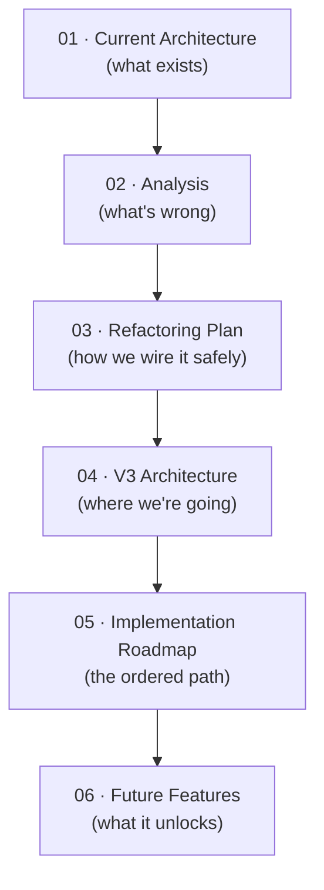
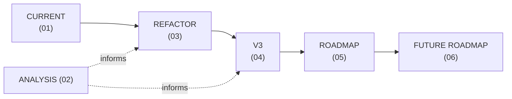

# Lumina Architecture Documentation

> **Status:** Reflects repository state at **Phase 5.4 Step 0** (2026-07-18).
> **Scope:** These documents consolidate six architectural analyses of the Lumina platform into a single, versioned reference set. They document and organize existing analysis; they do not introduce new architecture.

---

## Purpose

This folder is the authoritative architecture reference for the Lumina platform. It captures:

- the system as it exists today (current architecture),
- an honest assessment of its debt and risks (analysis),
- the incremental plan to wire the cognitive layer into the runtime (refactoring plan),
- the long-term target design (V3 architecture),
- the ordered path from today to the target (implementation roadmap),
- the candidate feature catalog and what unlocks each (future features).

> [!IMPORTANT]
> **Code is the source of truth.** Where these documents and the narrative TRUTH docs (`Docs/TRUTH/*`) disagree with the code, the code wins and the discrepancy should be reported. Several known doc/reality gaps are recorded in the individual documents.

---

## Document Index

| File | Title | What it contains |
|---|---|---|
| [`01_CURRENT_ARCHITECTURE.md`](01_CURRENT_ARCHITECTURE.md) | Current Architecture | Every subsystem as-built: runtime, DI, EventBus, BrainCore, registries, memory, session, bootstrap, planning, skills, legacy dispatch. Lifecycle, dependencies, invariants, hidden assumptions. |
| [`02_ARCHITECTURE_ANALYSIS.md`](02_ARCHITECTURE_ANALYSIS.md) | Architecture & Debt Analysis | Ranked architectural/technical debt, code smells, coupling, and the production bug hunt (race conditions, lifecycle, dispatch edge cases). |
| [`03_REFACTORING_PLAN.md`](03_REFACTORING_PLAN.md) | Phase 5.4 Integration & Refactoring Plan | The blueprint for wiring BrainCore into the runtime: interception points, session binding, feature-flag strategy, migration order, rollback. |
| [`04_V3_ARCHITECTURE.md`](04_V3_ARCHITECTURE.md) | Lumina V3 Target Architecture | The ideal end-state design across all subsystems; what survives V2, what is replaced. |
| [`05_IMPLEMENTATION_ROADMAP.md`](05_IMPLEMENTATION_ROADMAP.md) | Implementation Roadmap | Ordered path from current state → refactor → V3, with the dependency critical path and milestone sequencing. |
| [`06_FUTURE_FEATURES.md`](06_FUTURE_FEATURES.md) | Future Feature Catalog | 100 candidate features grouped by domain, each with difficulty, effort, dependencies, and current support level. |

---

## Reading Order

New contributors should read in numeric order. Each document assumes familiarity with the previous one.

- **Maintainers / reviewers:** read 01 → 02 → 03. These govern day-to-day change.
- **Architects / planners:** read 04 → 05 → 06. These govern long-term direction.

---

## How the Documents Relate

The document set encodes one continuous evolution: the system as it is, its measured problems, the safe near-term migration, the target design, the ordered path to reach it, and the features that path unlocks.

- **01 → 02:** the current design is measured for debt and latent bugs.
- **02 → 03:** the debt/bugs inform the near-term refactoring plan (Phase 5.4).
- **03 → 04:** the refactor is the first concrete step toward the V3 target.
- **04 → 05:** the target is decomposed into an ordered, dependency-aware roadmap.
- **05 → 06:** the roadmap's subsystems gate the feature catalog.

---

## Architecture Evolution (one line)

> **Current** → **Refactor (wire the Brain, flag-gated)** → **V3 (message-fabric, sandboxed, capability-secured)** → **Future Roadmap (features unlocked by new subsystems).**

---

## Governing Principles (unchanged across all documents)

> [!NOTE]
> These principles are stated here once and referenced throughout. They are descriptive of the existing project doctrine, not new proposals.

1. **Stable core.** The reasoning layer changes rarely; capabilities grow around it.
2. **The Brain never executes.** Planner plans, SkillManager executes, tools act.
3. **Strangler-fig migration.** Legacy is sacred until a flag-gated replacement proves byte-identical behavior. Never delete before proof.
4. **One composition root.** The Bootstrapper constructs everything.
5. **Failures return, never raise.** Planners return `None`; executors return failed `SkillResult`s; event handlers are error-isolated.
6. **Everything reversible.** Feature flags default off; every migration step reverts with one commit or one toggle.
